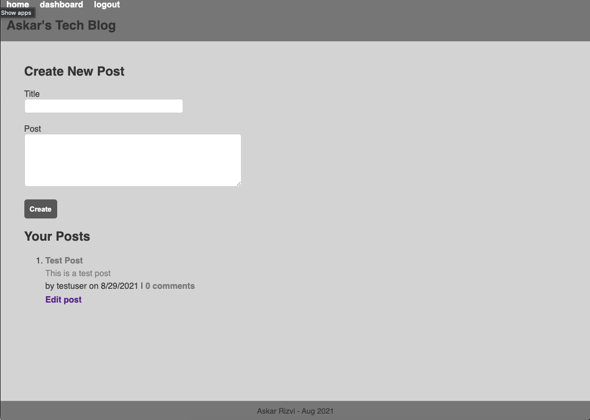
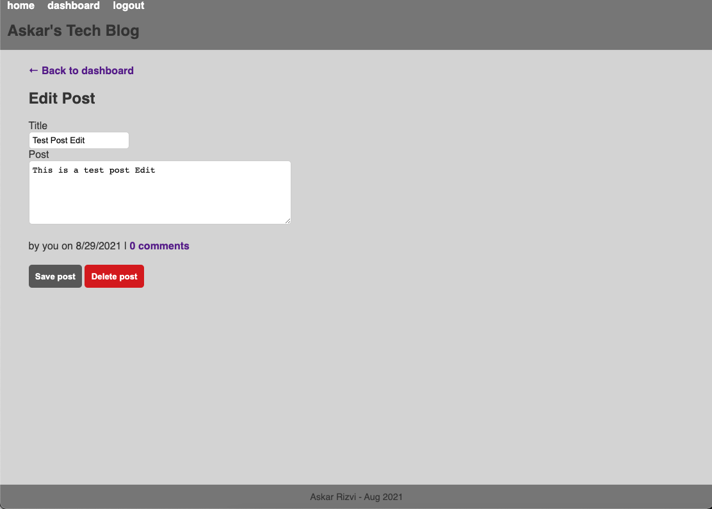
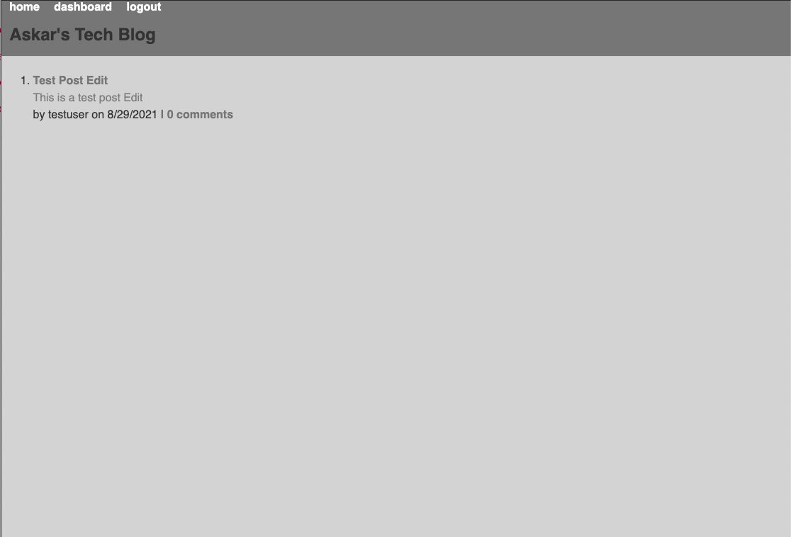

# Askar's Tech Blog

  

  ## Description
  The challenge for this week involves building a blog site for tech blogs. This involves building Sequelize models for the different tables, encrypting the user passwords, setting up a logged in user session and setting up the Express routes that will either read or modify the database depending on the REST API calls. The app follows the MVC paradigm and uses Handlebars as the templating language.

  ## Table of Contents

* [Installation](#installation)
* [Usage](#usage)
* [Credits](#credits)
* [License](#license)
* [Heroku](#heroku)
* [Questions](#questions)

## Installation
1: Clone the repository from Github 2:  Run NPM Install to install the modules 3:  Run "npm run seed" to seed the database 4:  Run "npm start" or "nodemon server.js" to start the server 5:  Navigate to http://localhost:3001/ 6:  Alternatively you can access the app through the Heroku deployment linked below 

## Usage

## License
https://opensource.org/licenses/MPL-2.0  
Licensed under Mozilla Public License 2.0

## Heroku
https://nameless-beyond-45887.herokuapp.com/

## Questions
https://github.com/askarrizvi  
